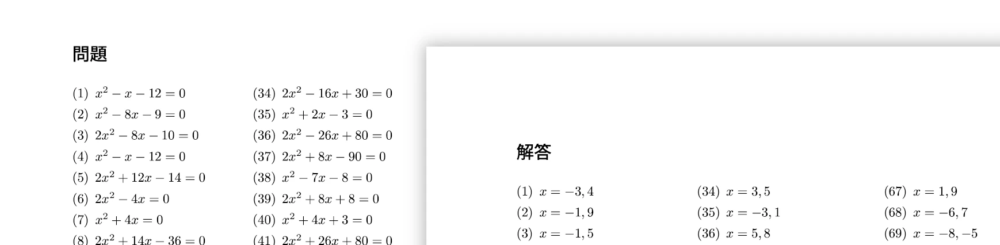

# math-print-maker


# build
Run this in the same directory of `main.go`.
```
go build -o printmaker
```

# usage
```
printmaker <option>
printmaker <problem type> <option>
```
## option
- `--help`
- `--h`

## problem type
- `decimal`
    - Generate decimal addition and subtraction problems and answers in pdf format.
- `integer`
    - Generate integer addition and subtraction problems and answers in pdf format. You can specify the number of digits.
- `matrix`
    - Generate matrix multiplication problems and answers in pdf format.
- `mod`
    - Generate division problems with a remainder and answers in pdf format.
- `quadratic`
    - Generate quadratic equation problems and answers in pdf format.

### option
#### common
- `-c <int>`, `--column <int>`   Number of columns (default 3)
- `-s <int>`, `--size <int>`     Number of problems (default 100)
- `-h`, `--help`         help for quadratic

#### `integer`
- `-m`, `--minus`        Generate subtraction problems
- `-p`, `--plus`         Generate addition problems
- `-r`, `--left`         Number of left term digit
- `-l`, `--right`        Number of right term digit

#### `decimal`
- `-m`, `--minus`        Generate subtraction problems
- `-p`, `--plus`         Generate addition problems

#### `matrix`
- `-d <int>`, `--dim <int>`      Dimension flag (default 3)

#### `mod`
- `-r`, `--left`         Number of left term digit
- `-l`, `--right`        Number of right term digit

#### `quadratic`
- none

### example
- Generate 300 decimal addition and subtraction problems in 2 columns format.
    ```
    printmaker decimal --size 300 --column 2
    ```

- Generate 100 decimal addition problems in 3 columns format.
    ```
    printmaker decimal --plus
    ```

- Generate 100 decimal subtraction problems in 3 columns format.
    ```
    printmaker decimal -m
    ```

- Generate 150 integer addition problems that the digit of left term is 2 and right term is 3 in 3 columns format.
    ```
    printmaker integer --size 150 --plus --left 2 --right 3
    ```

- Generate 350 integer subtraction problems that the digit of left term is 3 and right term is 2 in 3 columns format.
    ```
    printmaker integer --size 150 --minus -l 3 -r 2
    ```

- Generate 80 integer addition and subtraction problems that the digit of left term is 4 and right term is 3 in 3 columns format.
    ```
    printmaker integer -s 80 -l 4 -r 3
    ```

- Generate 300 2D matrix multiplication problems in 3 columns format.
    ```
    printmaker matrix --dim 2
    ```

- Generate 120 division problems with a remainderquadratic that the digit of left term is 3 and right term is 1 in 3 columns format.
    ```
    printmaker mod -s 120 --left 3 --right 1
    ```

- Generate 240 division problems with a remainderquadratic that the digit of left term is 5 and right term is 3 in 3 columns format.
    ```
    printmaker mod -s 240 -l 5 -r 3
    ```

- Generate 200 quadratic equation problems in 3 columns format.
    ```
    printmaker quadratic -s 200
    ```